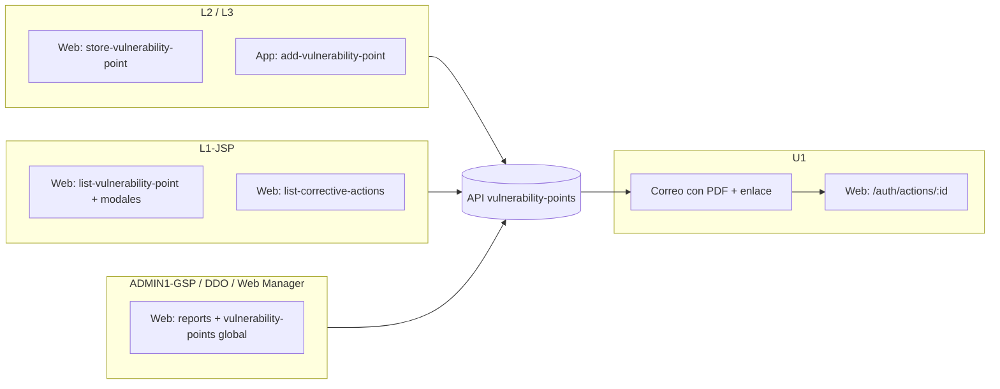

# Plan de trabajo — Flujo hallazgos y puntos vulnerables

Documento alineado con el diagrama **Hallazgos y puntos vulnerables (marzo 2026)**, con los **roles del sistema** y con la **implementación actual** en código.

- **Web:** `patrimonial_JEANLOGISTICS` (Angular)
- **App:** `banking_JEANLOGISTICS` (Ionic)
- **API:** `Seguridad_Patrimonial_CocaCola_Back` (Laravel)

---

## Roles de referencia (diagrama + backend)

| Código / uso en negocio | Nombre de rol en sistema (Spatie / seed) |
|-------------------------|------------------------------------------|
| L1-JSP (Jefe de SP) | `L1-JSP (JEFE DE SP)` |
| L2 Supervisor | `L2 - SUPERVISOR` |
| L3 Jefe de grupo | `L3-JG (JEFE DE GRUPO)` |
| U1 Responsable de área | `U1 - RESPONSABLE DE AREA` |
| ADMIN1 GSP | `ADMIN1 - GSP` |
| Director de operaciones | `DDO - Director de Operaciones` |
| Web Manager / Administrador general | `Web Manager`, `Web Manager/Administrador General`, `Administrador` (legado) |

Los permisos efectivos dependen de lo asignado a cada rol en BD; **ADMIN / Web Manager** suelen tener alcance global; **L1** debe verse acotado a **unidad operativa** según reglas del backend (`VulnerabilityPointCriteria` y vínculo usuario–`farms` / tipo).

---

## Qué ve cada rol en el flujo de **puntos de vulnerabilidad** (`vulnerability-points`)

Resumen operativo: el flujo gira en torno al **punto de vulnerabilidad**, las **acciones correctivas** hijas, los **responsables** (usuarios U1) y las **evidencias** (archivos del punto vs archivos de la acción).

### L2 — `L2 - SUPERVISOR` y L3 — `L3-JG (JEFE DE GRUPO)`

| Dónde | Vista / ruta | Qué información carga / acciones |
|-------|----------------|-----------------------------------|
| **Web** | `/vulnerability-points` → **listado** (`list-vulnerability-point`) | Lista filtrada por criterios de API (farm, búsqueda, paginación según usuario). Botones típicos: nuevo, editar, detalle (modal), export/PDF según permisos. |
| **Web** | `/vulnerability-points/create` y `/vulnerability-points/edit/:id` → **`store-vulnerability-point`** | Formulario completo: datos del punto (área, planta, factores de riesgo, fechas, afectación, etc.), **fotos del punto** (`files`), **acciones correctivas** con **responsables** (multiselect), evidencias iniciales de acción si aplica. Carga: `GET vulnerability-points/responsibles`, `risk-levels`, `risk-factors`, áreas vía servicio del módulo. |
| **App** | `vulnerability-points` → listado y **`add-vulnerability-point`** | Misma API (`POST/PUT vulnerability-points`); catálogos análogos (`responsibles`, niveles, factores, áreas). |
| **App** | *(Legacy / otro módulo)* `list-vulnerability`, `add-vulnerability` | Flujo **`vulnerability_evaluations`** (evaluaciones): **no es el mismo recurso** que `vulnerability-points`; usarlo solo si el rol aún opera ese módulo legado. |

**Diagrama:** capturan el concentrado; si **L1** devuelve, vuelven a editar aquí (misma pantalla de edición).

---

### L1 — `L1-JSP (JEFE DE SP)`

| Dónde | Vista / ruta | Qué información carga / acciones |
|-------|----------------|-----------------------------------|
| **Web** | `/vulnerability-points` (lista + detalle en modal **`vulnerability-detail-modal`**) | Concentrado de puntos; detalle con riesgo, fechas, acciones correctivas, responsables, evidencias del punto y de acciones. |
| **Web** | Misma ruta → edición **`store-vulnerability-point`** si tiene permiso | Validar datos, completar riesgos/compromisos, ajustar acciones y responsables según negocio. |
| **Web** | Listado de acciones (p. ej. **`list-corrective-actions`**) | Seguimiento por acción: estado, responsables, columna **correo abierto** (`email_opened_at`). |
| **App** | `vulnerability-points`, detalle / edición según rutas del módulo | Consistencia con web; depende de guards y menú por rol. |

**Diagrama:** solo ve datos de **su unidad operativa** — debe reflejarse en el API (filtros por usuario/farms). Si hoy ve más de lo debido, es **deuda a cerrar en criterios/guards**.

---

### U1 — `U1 - RESPONSABLE DE AREA`

| Dónde | Vista / ruta | Qué información carga / acciones |
|-------|----------------|-----------------------------------|
| **Web** | **`/auth/actions/:id`** (ruta pública de auth: `action-detail` / completar acción) | Flujo principal tras el correo: enlace **`/#/auth/actions/{id_acción}`** enviado por el backend. Completar acción, comentarios, subir evidencias de cierre (según pantalla implementada). |
| **Web** | Opcional: acceso desde app web logueado si existe bandeja en `actions` o módulo equivalente | “Mis acciones” filtradas por usuario responsable. |
| **App** | Deep link o módulo de detalle de acción / vulnerabilidad | Misma lógica de seguimiento si está expuesta en Ionic. |

**Notificación real (implementada):** al **crear** un punto o **crear** una acción correctiva nueva (en alta o en edición), el backend dispara **`NewCorrectiveActionEvent`** → correo **`NewCorrectiveActionNotification`** a cada usuario en **`responsibles`** de esa acción (canal `mail`, PDF adjunto, botón al detalle web).

**Nota frente al diagrama:** hoy el correo sale cuando **persisten** acciones con responsables, no hay en código un “solo después de marcar validado por L1” salvo que el flujo de negocio lo imponga por **estado** o por **momento de creación de la acción**. Si el diagrama exige “L1 valida y luego notifica”, hay que **acoplar envío de correos al cambio de estado** (tarea explícita).

---

### ADMIN1 — `ADMIN1 - GSP` y DDO — `DDO - Director de Operaciones`

| Dónde | Vista / ruta | Qué información carga / acciones |
|-------|----------------|-----------------------------------|
| **Web** | `/vulnerability-points` | **Todas las unidades** (según permisos y criterios del repositorio). |
| **Web** | `/reports` + reportes / gráficos de puntos de vulnerabilidad | Exposición en API: rutas tipo `graph_vulnerability_points`, export Excel, etc. |
| **Web** | Administración de usuarios / roles | Alta de responsables y asignación de roles. |

**Diagrama:** visibilidad global, menú de reportes (riesgo, hallazgos/vulnerabilidades, recorridos); **sin mezclar** con el alcance local de L1 en listados si los criterios están bien aplicados.

---

### `Web Manager`, `Web Manager/Administrador General`, `Administrador` (legado)

| Dónde | Vista / ruta | Notas |
|-------|----------------|------|
| **Web** | Todo lo anterior + configuración amplia | Suele equipararse a ADMIN en alcance de datos según `VulnerabilityPointCriteria` y otros criterios del API. |

---

## Implementación técnica relevante (correo y datos)

| Tema | Ubicación / comportamiento |
|------|----------------------------|
| Creación / actualización de punto | `POST/PUT api/.../vulnerability-points` — `VulnerabilityPointController@store` / `@update` |
| Acciones correctivas + responsables | Por cada acción: `responsibles()->sync(...)`, estado inicial **Pendiente** |
| Disparo de correo | `event(new NewCorrectiveActionEvent($correctiveAction))` en **store** (siempre) y en **update** solo si la acción fue **recién creada** |
| Listener | `NewCorrectiveActionListener` → `Notification::send($responsible, new NewCorrectiveActionNotification($action))` |
| Tracking “abrió el correo” | Endpoint marcado en flujo de acciones (`email_opened_at`); UI web en **`list-corrective-actions`** |
| Evidencias | Fotos del **punto**: relación `vulnerability_points_files`. Evidencias de la **acción**: `corrective_actions_evidences` (incluye cierre desde flujo por correo) |

---

## Principios del flujo (reglas de negocio — diagrama)

| Momento | Regla |
|---------|--------|
| Captura | **L2 / L3** cargan el concentrado del punto de vulnerabilidad. |
| Validación | **L1-JSP** valida; si no aplica, **devuelve a L2/L3** con motivo. |
| Formalización | Riesgos, acción correctiva, fecha compromiso, **responsables U1**, seguimiento de estatus. |
| Alcance | **L1** concentrado **solo de su unidad operativa** (objetivo; validar en API/UI). |
| Notificación | Responsables **U1** reciben aviso (hoy: **correo** al crear acción correctiva con ellos asignados). |
| Cierre | **U1** atiende, comenta y sube evidencias; estados hasta **Finalizada**, etc. |
| Integridad | Diagrama: **no borrar** tras validación L1 — revisar política en `DELETE` y botones de lista. |

---

## Fases de trabajo (resumen)

1. **Modelo y estados:** definir estados del punto (borrador / pendiente L1 / validado / …) y si el **correo** debe moverse al paso “validado por L1”.
2. **Criterios API:** asegurar filtro **L1 = su unidad**; **ADMIN/DDO/Web Manager** = global según rol.
3. **Permisos UI:** menú y rutas (`canRole` / permisos) para L2, L3, L1, U1, ADMIN1, DDO.
4. **Paridad app:** priorizar **`vulnerability-points`** + **`add-vulnerability-point`**; documentar qué hacer con **`vulnerability_evaluations`** legado.
5. **QA:** rol por rol — alta L2/L3, validación L1, recepción de correo U1, cierre, columnas `email_opened`, intento de borrado prohibido.

---

## Diagrama — vistas por rol (referencia)

---

## Rutas en código (cheat sheet)

| Proyecto | Rutas / componentes |
|----------|---------------------|
| **patrimonial_JEANLOGISTICS** | `/vulnerability-points` → `list-vulnerability-point`, `store-vulnerability-point`; modales `vulnerability-detail-modal`, acciones; `/auth/actions/:id`; `/reports` |
| **banking_JEANLOGISTICS** | `vulnerability-points` (módulo), `add-vulnerability-point`, `corrective-actions`, `vulnerability-details`; legado: `vulnerability_evaluations` bajo `list-vulnerability` / `add-vulnerability` |
| **Seguridad_Patrimonial_CocaCola_Back** | `VulnerabilityPointController`, evento `NewCorrectiveActionEvent`, notificación `NewCorrectiveActionNotification`, `CorrectiveActionController` (completar / rechazar / finalizar) |

---

*Última actualización: ajustado por roles, vistas reales y flujo de correo según código backend/front.*
